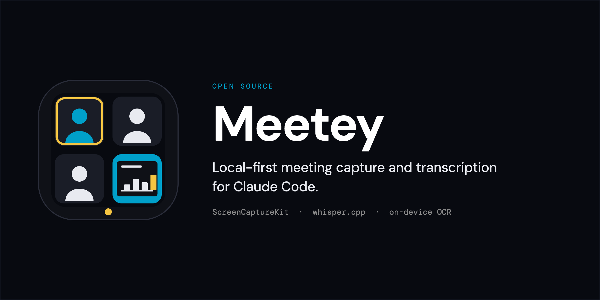

# Meetey

[](LICENSE)
[](#requirements)

Join a meeting, run `/meetey start`, and get back dated notes where every decision and action item carries the `[mm:ss]` it came from. Audio comes off the meeting app through macOS ScreenCaptureKit, whisper.cpp does the transcription, and Claude writes the summary. Screen content — slides, screen shares, code — is opt-in per meeting, with text recognized on-device. If you'd rather not remember to hit record, Meetey can [watch for meetings and ask](#recording-without-remembering-to).

Recording and transcription happen entirely on your machine. No subscriptions, no third-party meeting bots, no cloud transcription service. See [What stays local](#what-stays-local) for exactly what is and isn't sent anywhere.

## Install

Requires macOS 13+, Node.js 18+, and Xcode Command Line Tools.

```bash
npx jej2k5/meetey install
```

This will:
- Install whisper-cpp via Homebrew (if not already present)
- Download the Whisper base model (~142 MB) to `~/.meetey/models/`
- Build and sign the Swift capture binary
- Register the MCP server in Claude Code
- Install the `/meetey` skill
- Add shortcuts inside Claude Code (`Ctrl+Shift+R` / `Ctrl+Shift+S`)

After installation, open System Settings → Privacy & Security → Screen Recording and enable your terminal app. Then start a new Claude Code session.

## Usage

### In Claude Code

```
/meetey start    Detect running meeting apps and start recording
/meetey stop     Stop recording, transcribe, and save notes
/meetey status   Check whether a recording is active

/meetey watch    Ask to record meetings automatically (off by default)

/meetey list     Browse past meetings
/meetey show     Open one meeting's notes
/meetey search   Find a moment across every meeting
/meetey delete   Remove a recording
/meetey doctor   Check the install
```

`/meetey start` asks whether to also capture screen content. Answer up front to skip the question:

```
/meetey start --video       Audio + screen keyframes
/meetey start --audio-only  Audio only
```

Or use the shortcuts:

| Shortcut | Action |
|--------|--------|
| `Ctrl+Shift+R` | `/meetey start` |
| `Ctrl+Shift+S` | `/meetey stop` |

These are shortcuts *inside Claude Code*, not system-wide hotkeys — they only fire while Claude Code is the focused window. To stop a recording from anywhere, use the [menu bar item](#while-a-recording-is-running).

### While a recording is running

A menu bar item appears for as long as Meetey is recording, showing what it's recording and for how long. **Stop Recording** ends it without switching back to Claude Code.

```
                                   ◉ 12:04  ⌄
                          ┌──────────────────────────────┐
                          │  Weekly Sync — Google Meet   │
                          │  Audio only · 12:04          │
                          │  ──────────────────────────  │
                          │  Stop Recording              │
                          └──────────────────────────────┘
```

The dot is red while recording, and it tells you **what** is being captured: `Audio only` and `Audio + screen` are different things to have agreed to, and they never look the same.

If Meetey thinks your call has ended, it says so before acting — and lets you overrule it:

```
                                   ◌ ending soon  ⌄
                          ┌──────────────────────────────┐
                          │  Weekly Sync — Google Meet   │
                          │  Call may have ended · 8:12  │
                          │  ──────────────────────────  │
                          │  Keep Recording              │
                          │  Stop Recording              │
                          └──────────────────────────────┘
```

It's there partly as a control and partly so you can always tell at a glance that recording is happening — every other signal Meetey gives you is a single moment, and this one lasts the whole meeting.

Stopping saves the audio; it doesn't write the notes. A notification says so, and `/meetey stop` in Claude Code picks the recording up and writes it up.

### Workflow

1. Join your meeting in Chrome (Google Meet / Teams web), Zoom, or Microsoft Teams
2. Run `/meetey start` — Claude detects the running app, asks whether to capture screen content, and begins recording
3. When the meeting ends, run `/meetey stop` — Claude transcribes the audio, reads any screen content, and produces:

```
## Q3 Roadmap and API Cutover

**Recorded:** Fri 1 Aug 2026, 2:02–2:47 PM · 45 min

### Summary
...

### Key Decisions
- **[12:04]** Ship v1.1 without the motion heuristic; revisit next cycle

### Action Items
- [ ] **[31:17]** Draft the migration doc — Priya · due Friday

### Screen Content          ← only when screen capture was used
- **[04:12]** Burndown chart, actual tracking ~11 days behind plan

### Transcript
Full transcript: `2026-08-01-1402-q3-roadmap-transcript.md` · 6,180 words
```

**Every claim carries the timestamp it came from.** If you doubt a decision, jump straight to that moment in the transcript instead of searching thousands of words.

Notes are written to `~/.meetey/recordings/` as `YYYY-MM-DD-HHMM-<slug>.md` — chronologically sortable, so `ls` is a meeting history. The transcript lives in a sibling `-transcript.md` file rather than inline, so the notes stay scannable.

### If you forget to stop

Forget step 3 and the recording still ends itself — when your call ends, or when the app quits or the captured window closes. Run `/meetey stop` afterwards anyway to write the notes; it picks the finished recording up and tells you why it ended.

Ending on the call itself is worth explaining, because it works differently than you'd expect. Meetey watches whether the meeting app is holding the microphone, which apps release when you hang up (muting yourself doesn't count — that's just a switch). But that clue is occasionally wrong, and stopping a live meeting by mistake loses audio you can't get back. So instead of stopping, it notes the time and **keeps recording**. If the call turns out to still be going, the note is thrown away and nothing is lost. Only after ten quiet minutes — and only if nobody spoke during them — does it stop, and then it cuts the file back to the moment you actually hung up. The waiting never reaches your transcript.


When the transcription is unreliable, the notes say so at the top instead of summarizing noise with a confident voice:

```
> ⚠️ Transcription quality: poor — 80% of segments were silence markers,
> fragments, or repeats. Summary may be incomplete; ggml-base.en.bin was used.
```

That assessment is computed from the transcript itself (fragment rate, whisper looping, speech pace against spoken time), not guessed.

### Supported apps

| App | Audio captured | Screen captured (opt-in) |
|-----|----------------|--------------------------|
| Chrome | All Chrome audio | One chosen window, or everything Chrome displays |
| Zoom | Zoom meeting audio | The Zoom window, including screen shares |
| Microsoft Teams (desktop) | Teams meeting audio | The Teams window, including screen shares |

> **Chrome note:** **audio** is captured at the **process** level — all Chrome audio, not just the meeting tab — so mute any other tabs playing audio before starting. For **screen** capture you can narrow to a single window, which excludes the app's other windows and its notification banners. You cannot narrow to a tab: macOS offers no tab-level capture, so whatever tab that window is showing is what gets captured.

## Screen capture

Meetey can also capture what was on screen — slides, screen shares, code, diagrams — and fold it into the notes.

**It is off by default and opt-in per meeting.** Claude asks every time you run `/meetey start`; there is no setting that turns it on permanently. Skip the question with `/meetey start --video` or `/meetey start --audio-only`.

```
/meetey start --video     Record audio + screen keyframes
/meetey start --audio-only  Record audio only, don't ask
```

**Choose a window, not just an app.** After you opt in, Claude lists the app's windows by title — `Weekly Sync — Google Meet` rather than "all of Chrome" — and capturing one window keeps the app's other windows and its notification banners out of frame entirely. If more than one display is attached you'll be asked which; otherwise Meetey picks the one showing the meeting.

ScreenCaptureKit has no concept of a browser tab, so a window is as fine as macOS allows. To isolate a single tab, drag it into its own window and pick that. Switching tabs inside the captured window captures the new tab.

Instead of recording video, Meetey samples the screen once a second and keeps a JPEG **only when the picture materially changes**. An hour-long meeting typically yields a few dozen keyframes rather than 3,600, which is what makes this cheap enough to be worth doing:

| | Storage/hr | Sent to Claude |
|---|---|---|
| Audio | ~115 MB | ~12K tokens (transcript) |
| Screen keyframes | ~10 MB | ~5K tokens (recognized text) |

Text is recognized on-device with the macOS Vision framework, so the default path sends only text. Claude reads an actual keyframe image only when the text isn't enough — a diagram, a chart, a UI screenshot.

> ⚠️ **Screen capture records everything the target app displays** — other tabs, other windows of that app, and notification banners that appear over it. A screen share can contain credentials, customer data, or a colleague's private dashboard. Close or mute anything sensitive before you opt in.

Keyframes are written to `~/.meetey/recordings/<session>-frames/` and are **not** deleted automatically — the notes reference them, so removing them would make the summary unverifiable. Delete that folder yourself when you're done with it.

Two rules do most of the work of keeping that number small:

- **A keyframe is written when the screen stops moving, not when it starts.** A slide transition collapses to a single file — the settled one, which also reads far better than anything caught mid-fade.
- **Regions that are always moving stop counting.** A speaker tile, a progress bar, a clock: if a part of the screen changes constantly, it is excluded from the comparison. That is what makes the usual slide-plus-speaker-tile layout produce about one keyframe per slide.

Returning to a slide you already showed doesn't write it twice — the manifest records that it came back, and the notes can cite both moments from one image.

Tuning, if you need it (pass through to `meetey-capture`):

| Flag | Default | Purpose |
|---|---|---|
| `--fps <n>` | `1` | Frames sampled per second |
| `--scene-threshold <n>` | `12` | Grid cells (of 1024) that must change to count as a new scene. Raise it if you're still getting near-duplicates; lower it if a subtle slide edit was missed |
| `--max-frames <n>` | `200` | Hard cap per session |
| `--max-unsettled <secs>` | `60` | Force a keyframe if the screen never comes to rest, so a video demo still records something |
| `--no-volatility-mask` | off | Stop ignoring constantly-moving regions |
| `--no-ocr` | off | Skip on-device text recognition |

`sceneThreshold`, `windowID`, and `displayID` are all reachable from `/meetey start` — just ask.

**Camera-heavy calls used to be a poor fit.** A moving video tile once produced a keyframe every couple of seconds until the 200-frame cap was hit, usually within the first ten minutes, leaving the rest of the meeting uncaptured. Moving tiles are now ignored, so that no longer happens. A faces-only call still won't produce anything worth reading — stay on audio for those — but it will no longer exhaust the budget and go dark.

## Recording without remembering to

Meetey can watch for meetings and offer to record them, so you don't have to think about `/meetey start` at the moment a call begins.

```
/meetey watch on      Turn it on
/meetey watch         Is it on?
/meetey watch off     Turn it off
/meetey watch log     What it has noticed
```

Or from a terminal: `npx jej2k5/meetey watch enable | disable | status | logs`.

**It never records on its own.** When it notices a meeting it asks, naming the window:

```
┌──────────────────────────────────────────────┐
│  Meetey noticed a meeting:                   │
│                                              │
│  Weekly Sync — Google Meet                   │
│                                              │
│  Record it? "Audio + screen" captures only   │
│  this window. It stops on its own when the   │
│  call ends.                                  │
│                                              │
│   [ Skip ]  [ Audio + screen ]  [ Audio only ]│
└──────────────────────────────────────────────┘
```

Skip and it won't ask again for that meeting. A prompt you never answer times out as a no, and Return is wired to Skip so an absent-minded keystroke can't start a recording.

Three things worth being clear about:

- **It is off until you turn it on**, and turning it on installs a login agent that persists across restarts until you turn it off.
- **You choose what it captures.** The prompt offers audio only or audio + screen, and screen capture covers just the meeting window it found — narrower than what `/meetey start` captures by default.
- **It does not detect that a call *ended*.** The recording stops when the app quits or the captured window closes — not when a meeting wraps up while the app stays open. Detection is deliberately loose in the other direction too: it would rather ask about something that isn't a meeting than miss one, since a wrong guess costs one dismissed dialog.

Recordings it makes are transcribed as soon as they end, so they're ready by the time you get to them. `/meetey list` shows them alongside everything else; `/meetey stop` works on one that's still running.

Enabling checks that it can actually see your windows before saying it worked, so if permission is missing you'll be told at that moment rather than discovering it after a missed meeting. `/meetey watch` reports the same thing any time.

## Managing your meetings

Everything about the library is reachable from Claude Code — there's no separate app, dashboard, or web UI to open. Every subcommand has a plain-language equivalent, so use whichever you'd reach for:

| Subcommand | Or just ask | Tool |
|---|---|---|
| `/meetey list` | *"what meetings do I have this week?"* | `list_recordings` — title, date, duration, quality, keyframe count, size. Filter by date range, quality, or whether screen capture was on |
| `/meetey show` | *"show me the standup from Thursday"* | `get_recording` — one meeting in full, including the notes and paths to its audio, transcript, and keyframes |
| `/meetey search` | *"what did we decide about the API cutover?"* | `search_recordings` — searches every meeting's notes and transcripts, returning the matching line **with its `[mm:ss]`** so you land on the moment |
| `/meetey delete` | *"delete yesterday's test recording but keep the notes"* | `delete_recording` — shows what it would delete and does nothing until you confirm; `--keep-notes` drops the audio and keyframes but keeps the writing |
| `/meetey doctor` | *"is meetey working? screen recording seems broken"* | `system_status` — install health, Screen Recording permission, active model, disk used |

`/meetey status` is about the recording running *right now*; `/meetey doctor` is about whether the install itself is healthy.

Search is the one worth knowing about. Asking *"what did we decide about the API cutover?"* returns the decision, the meeting, and the timestamp — so you can jump straight to that second in the transcript instead of reading it.

## What stays local

| Stays on your machine, always | Sent to Claude to write the summary |
|---|---|
| Meeting audio (the WAV) | The transcript text |
| Screen keyframes (the JPEGs) | Recognized on-screen text (OCR) |
| Whisper transcription — runs locally | A few keyframe **images**, only when text isn't enough |
| Vision OCR — runs on-device | |

Nothing is uploaded to a third-party meeting service, and no bot joins your call. Audio and images never leave your machine unless Claude needs a specific keyframe to interpret a diagram. Summarization itself runs through Claude, so the *text* does go to the API — the same as anything else you'd paste into Claude Code.

Nothing records without a person saying so. `/meetey start` is explicit, and the optional watcher asks before every recording — there is no mode in which Meetey captures a meeting you weren't asked about. Screen capture is a separate opt-in on top of that, requested per recording, and the watcher never requests it.

## CLI

```bash
npx jej2k5/meetey install         # First-time setup
npx jej2k5/meetey update          # Rebuild binary and refresh MCP server + skill
npx jej2k5/meetey status          # Show what's installed and whether everything is wired up

npx jej2k5/meetey watch enable    # Watch for meetings and offer to record them
npx jej2k5/meetey watch disable   # Stop watching
npx jej2k5/meetey watch status    # Is the watcher running?
npx jej2k5/meetey watch log       # Recent watcher activity
```

`status` output:

```
Meetey status

  ✔  meetey-capture binary  (~/.meetey/meetey-capture/.build/release/meetey-capture)
  ✔  binary code-signed
  ✔  whisper-cli  (/opt/homebrew/bin/whisper-cli)
  ✔  Whisper model (ggml-base.en.bin)  (~/.meetey/models/ggml-base.en.bin)
  ○  meeting watcher (optional)  (off — enable: meetey watch enable)
  ✔  MCP server files  (~/.meetey/mcp-server)
  ✔  MCP server registered in ~/.claude.json
  ✔  /meetey skill installed
  ✔  Claude Code shortcuts  (Ctrl+Shift+R / Ctrl+Shift+S, while Claude Code is focused)
```

### Staying current

`npx jej2k5/meetey status` tells you whether a newer version has been released:

```
  installed: 1.4.1
  update available: 1.4.1 → 1.5.0
    npx jej2k5/meetey update
```

This is the only part of Meetey that contacts a server. It's an anonymous request for the repository's latest release tag — nothing about you or your machine is sent, and the answer is a version string. The result is cached for a day, times out after two seconds, and is skipped silently if you're offline. `MEETEY_NO_UPDATE_CHECK=1` turns it off entirely.

`/meetey doctor` reports the same thing, but never makes the request itself — it only reads what the CLI last found.

## Requirements

- macOS 13 (Ventura) or later
- Node.js 18+
- Xcode Command Line Tools (`xcode-select --install`)
- Claude Code
- Homebrew (installed automatically if missing)

## Whisper model

The default model is `ggml-base.en.bin` (~142 MB), stored at `~/.meetey/models/`. It handles clear English speech well. For better accuracy on accented speech or technical vocabulary, switch to a larger model:

| Model | Size | Notes |
|-------|------|-------|
| `ggml-base.en.bin` | 142 MB | Default. Fast, good for clear English. |
| `ggml-small.en.bin` | 466 MB | Better accuracy. |
| `ggml-large-v3-turbo-q5_0.bin` | 1.1 GB | Best accuracy. Slower. |

To switch, download the model to `~/.meetey/models/` and set `MEETEY_MODEL` in the `mcpServers.meetey.env` section of `~/.claude.json`.

## Troubleshooting

| Problem | Fix |
|---------|-----|
| `meetey-capture binary not found` | Run `npx jej2k5/meetey install` |
| `Whisper model not found` | Run `npx jej2k5/meetey install` |
| App not listed by `/meetey start` | Ensure the meeting app is open and a call is active |
| Blank or garbled transcript | Check Screen Recording permission: System Settings → Privacy & Security → Screen Recording |
| Chrome captures wrong audio | Mute other tabs playing audio before starting |
| MCP tools not available after install | Restart Claude Code — MCP servers connect at session startup |
| `Ctrl+Shift+S` does nothing mid-meeting | It's a Claude Code shortcut, not a system-wide hotkey — it only fires when Claude Code is focused. Stop from the menu bar instead |
| No screen content in the notes | Screen capture is opt-in per meeting — start with `/meetey start --video` |
| Too many near-identical keyframes | Narrow to one window when you start; failing that, raise `--scene-threshold` |
| Slide changes missed | Lower `--scene-threshold` (fewer cells needed to count as a new scene) |
| Keyframe text is garbled | Confirm the meeting window isn't scaled down; OCR runs on the captured resolution |
| Keyframes from the wrong screen | Pass a `displayID`, or pick a window — Meetey otherwise guesses from where the app is |
| Recording stopped early | It ends when your call ends, the app quits, or the captured window closes. Rejoining in a new window won't resume it |
| Recording didn't stop when the call ended | Only fires if the app took the microphone in the first place — joining by phone while sharing your screen leaves nothing to detect. It falls back to stopping when the app quits |
| `/meetey stop` says no recording is active | If it already stopped itself, `/meetey stop` still collects it. If that fails, the WAV is in `~/.meetey/recordings/` |
| Watcher never asks | `/meetey watch` — if it says it can't see windows, Node needs Screen Recording permission, separately from the capture binary |
| Watcher asks about things that aren't meetings | Expected — it errs toward asking. Say "Not now" and it drops that window |

## How it works

```
/meetey skill  → MCP server (Node.js, ~/.meetey/mcp-server/) → meetey-capture (Swift, ~/.meetey/)
watch agent   ↗  (~/.meetey/daemon/, optional)               → whisper-cli
```

**meetey-capture** is a Swift CLI using ScreenCaptureKit. It takes `--app <bundle-id>` and `--output <path.wav>`, records app audio as 16-bit PCM WAV at 16 kHz mono, and stops on SIGTERM, on `--stop-after`, or via `--auto-stop` when the app quits or the captured window closes. With `--video` it also samples the screen, keeps a JPEG when the picture settles into something new, and runs Vision OCR on each one.

**MCP server** manages the capture process lifecycle and shells out to `whisper-cli` for transcription. Registered globally in `~/.claude.json` so it's available in every Claude Code session.

**`/meetey` skill** drives the user-facing flow: `list_apps → list_windows → start_recording → stop_recording → transcribe → get_keyframes`, then formats and saves the output.

**Watch agent** is an optional launchd LaunchAgent that notices meetings and asks whether to record them. It is off until enabled and starts nothing without a confirmation. Because it's a separate process from the MCP server, both coordinate through a state file keyed on process liveness — which is why `/meetey stop` can stop a recording the watcher started.

Two self-tests run without Screen Recording permission or a live meeting:

```bash
meetey-capture --selftest        # scene detection, settling, dedup, OCR, manifest, auto-stop
node ~/.meetey/daemon/watch.js --selftest   # meeting detection patterns
```

## Files written

| Path | Contents |
|------|----------|
| `~/.meetey/recordings/*.wav` | Raw audio from each session |
| `~/.meetey/recordings/YYYY-MM-DD-HHMM-<slug>.md` | Structured notes — summary, timestamped decisions and action items, screen content |
| `~/.meetey/recordings/YYYY-MM-DD-HHMM-<slug>-transcript.md` | Full transcript, one timestamped line per utterance |
| `~/.meetey/recordings/*-frames/` | Screen keyframes + `index.json` (only when screen capture was used) |
| `~/.meetey/models/ggml-base.en.bin` | Whisper model |
| `~/.meetey/mcp-server/` | MCP server (stable install location) |
| `~/.meetey/meetey-capture/` | Swift binary and sources |
| `~/.meetey/daemon/` | Watch agent (dormant unless enabled) |
| `~/.meetey/state/active.json` | Which recording is running, if any — removed when it ends |
| `~/.meetey/logs/watch.log` | Watcher activity (only when enabled) |
| `~/Library/LaunchAgents/com.meetey.watch.plist` | Watcher login agent (only when enabled) |

## Contributing

Issues and pull requests are welcome. To work on Meetey from a local clone:

```bash
git clone https://github.com/jej2k5/meetey.git
cd meetey
node cli/index.js install     # build, sign, and register everything locally
```

After changing Swift sources, rebuild and re-sign:

```bash
cd meetey-capture
swift build -c release
codesign --force --sign - --options runtime --entitlements entitlements.plist \
  .build/release/meetey-capture
```

Then restart Claude Code so the MCP server reconnects.

New source files should carry the Apache 2.0 header used by the existing files.
By contributing, you agree that your contributions are licensed under the Apache
License 2.0.

## License

Copyright 2026 John Joseph

Licensed under the Apache License, Version 2.0 (the "License"); you may not use
this file except in compliance with the License. You may obtain a copy of the
License at [http://www.apache.org/licenses/LICENSE-2.0](http://www.apache.org/licenses/LICENSE-2.0).

Unless required by applicable law or agreed to in writing, software distributed
under the License is distributed on an "AS IS" BASIS, WITHOUT WARRANTIES OR
CONDITIONS OF ANY KIND, either express or implied. See the [LICENSE](LICENSE)
file for the specific language governing permissions and limitations under the
License.

Third-party attributions are listed in [NOTICE](NOTICE).
